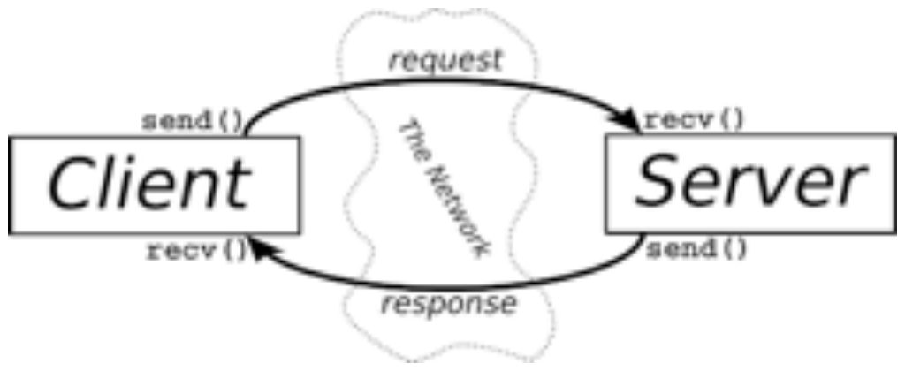

# IRC

!!!! тут ассемблер пока побудет, только не забыть потом удалить

Internet Relay Chat or IRC is a text-based communication protocol on the Internet.

It offers real-time messaging that can be either public or private. Users can exchange
direct messages and join group channels.

Нужно создать свой IRC сервер.

Клиент создавать не нужно, есть готовые клиенты, чтобы потестить наш сервер. (KVIrc)

[IRC RFC](https://datatracker.ietf.org/doc/html/rfc1459#page-48)

[IRC RFC на русском](https://www.lissyara.su/doc/rfc/rfc1459/)

[книга сетевому программированию](https://beej.us/guide/bgnet/translations/bgnet_A4_rus.pdf)

[select и poll](https://it.wikireading.ru/24833)

[sockaddr и sockaddr_in](https://www.russianblogs.com/article/8587603498/)

[видео по ft_irc](https://www.youtube.com/watch?v=I9o-oTdsMgI)

Большая часть того, что снизу из книжки сверху :)

и эта картинка тоже отуда:

### Клиент

* KVIrc - клиент с интерфейсом
* утилита nc - без синтаксиса

### Синтаксис

### Команды

* регистрация:
  - PASS:
  - NICK:
  - USER:
* сообщения:
  - PRIVMSG: 
  - NOTICE:
* присоединение и создание канала:
  - JOIN
* команда для операторы:
  - KICK: удалить клиента из канала

### htons() (**H**ost **to** **N**etwork **S**hort)
Допустим, нужно представить двухбайтное шестнадцатиричное число (b34f). Его байты (b3 4f) должны храниться в памяти последовательно.

Так вот эти байты на компьютере могут храниться в разном порядке:
* Big-Endian (или Network Byte Order)
b3 и следом 4f
* Little-Endian
сначала 4f, затем b3

Сеть использует Big-Endian, так что мы должн быть уверены, что, когда заполняем структуры для отправки, 
числа в этой структуре построены в Big-Endian.

Поэтому нам нужно прогонять данные для структуры через функции вроде **htons**.

### inet_pton() (presentation to network)
Преобразует строковый IP адрес (ddd.ddd.ddd.ddd) в структуру struct in_addr либо struct in6_addr в зависимости от
указанных AF_INET или AF_INET6. Замена inet_addr().

Еще есть inet_ntop() для обратного преобразоввния.

### struct sockaddr_in

Используется как замена структуре sockaddr (потому что помимо семейства протокола (AF_INET или AF_INET6) в sockaddr еще есть поле char sa_data[14], в котором должны храниться адрес назначения и номер порта для сокета, и легче заполнить структуру sockaddr_in, чем массив sa_data) - если нужно послать в функцию (например, в connect() или bind()) sockaddr_in приводится к sockaddr.

struct sockaddr_in {

 short int sin_family; // Семейство адресов, AF_INET
 
 unsigned short int sin_port; // Номер порта
 
 struct in_addr sin_addr; // Интернет адрес
 
 unsigned char sin_zero[8]; // Размер как у struct sockaddr
 
};

### struct in_addr

### accept()
int accept(int sockfd, struct sockaddr *addr, socklen_t *addrlen); 

* клиент пытается подключиться вызовом connect() к вашей машине
на порт, который вы слушаете вызовом listen()
* Это соединение будет поставлено в очередь ждать accept()'а
* Вызываем accept() и говорим ему принять ожидающие подключения
* accept() вернёт новый fd сокета для использования с одним подключением
* Исходный до сих пор слушает новые подключения,
а вновь созданный полностью готов к send() и recv()

### select()
int select(int n, fd_set *readfds, fd_set *writefds, fd_set *exceptfds, struct timeval *timeout);

параметры по порядку:

* сколько элементов просматривать в множестве
* множество которое нужно проверять на возможное чтение
* множество которое нужно проверять на возможную запись
* множество которое нужно проверять на наличие исключительных ситуаций
* таймаут в течении которого надо с этим работать (если NULL, то висим на этой функции
  пока один из каналов в множестве activeSet не проявит активность)

* блокируемся на select, а не на accept